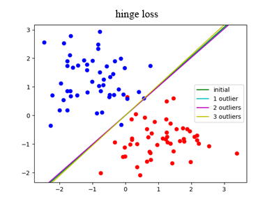
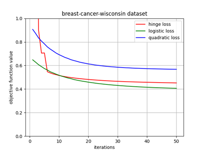
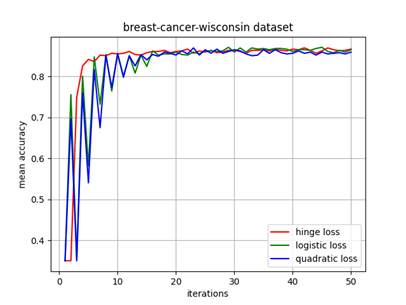
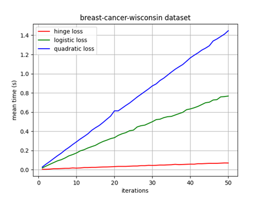

# University Project (Course Paper)
## "Application of the subgradient method to minimize the Hinge Loss in SVM binary classifier".

The goal of the project is to apply subgradient method to Support Vector Machine with hinge loss in order to reveal a range of positive features comparing to the same SVM with traditional differentiable loss functions. The project discovered boost in speed, better robustness and convergence rate on several datasets.

**Languages**: Python.

**Packages**: numpy, pandas, matplotlib.

### Some results

**Robustness tests**
<table>
         <tr>
            <td></td>
            <td></td>
           <td></td>
         </tr>
</table>

**Performance plots**
<table>
         <tr>
            <td></td>
            <td></td>
           <td></td>
         </tr>
</table>
